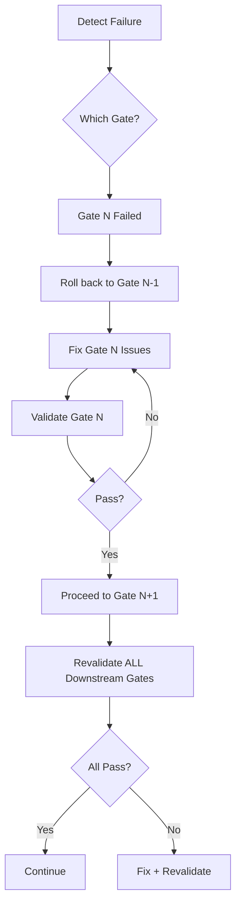

# Integrated Rectification Plan
## Systematic Process Validation & Revalidation

**Status**: Active
**Created**: 2025-11-07
**Methodology**: Gated validation with dependency-ordered fixes

---

## Executive Summary

This plan addresses **11 failing test suites** and **1,956 ESLint issues** through systematic validation gates. Each gate must achieve 100% pass criteria before proceeding to the next.

### Current State (Baseline Audit)

```
Test Suites: 11 FAILED, 7 PASSED (61% failure rate)
Tests: 13 failed, 206 passed (6% failure rate)
ESLint: 1,956 problems (1,272 errors, 684 warnings)
TypeScript: type-check runs but shows errors
Build: Compiles but with warnings
```

### Target State (After Rectification)

```
Test Suites: 0 FAILED, 18 PASSED (100% pass rate)
Tests: 0 failed, 220 passed (100% pass rate)
ESLint: <50 problems (strategic ignores only)
TypeScript: type-check passes with 0 errors
Build: Clean compilation
```

---

## Validation Methodology

### Gated Process Flow

```
Gate 0: Foundation     →  Gate 1: Core Services  →  Gate 2: Integration
   ↓ validate              ↓ validate                ↓ validate
Gate 3: Platform       →  Gate 4: Components     →  Gate 5: Quality
   ↓ validate              ↓ validate                ↓ validate
Gate 6: Final Validation → PRODUCTION READY
```

**Rules**:
1. Each gate has **binary pass/fail criteria** (no partial credit)
2. All criteria must pass before advancing
3. **Revalidation**: If a gate fails after proceeding, roll back and fix
4. **Impact analysis**: Check downstream gates after each fix
5. **Commit per gate**: One atomic commit per validated gate

---

## Gate 0: Foundation (Test Infrastructure)

**Goal**: Fix test environment so tests CAN run without crashing

### Issues Identified

| Issue | Impact | Files |
|-------|--------|-------|
| Missing native mocks | 3 suites crash | `react-native-encrypted-storage` |
| Missing component modules | 2 suites fail | `ProgressChart`, `ExerciseSummary` |
| Native module resolution | Platform tests crash | `SettingsManager`, `PermissionsAndroid` |
| Worker process leaks | Test runner hangs | All async tests |

### Acceptance Criteria

✅ **G0.1**: All test suites load without module resolution errors
✅ **G0.2**: No test suite crashes on initialization
✅ **G0.3**: Test runner exits cleanly (no worker process failures)
✅ **G0.4**: Jest setup loads all required mocks

### Implementation Tasks

**G0.1: Create Missing Native Mocks**
```bash
# Task: Create encrypted storage mock
File: __mocks__/react-native-encrypted-storage.js
Action: Mock setItem, getItem, removeItem, clear

# Task: Create settings manager mock
File: __mocks__/react-native/Libraries/Settings/NativeSettingsManager.js
Action: Mock Android/iOS settings APIs

# Task: Create permissions mock
File: __mocks__/react-native/Libraries/PermissionsAndroid/PermissionsAndroid.js
Action: Mock permission request/check flows
```

**G0.2: Create Missing Component Stubs**
```bash
# Task: Create ProgressChart stub
File: src/components/progress/ProgressChart.tsx
Action: Create minimal stub or move from backup

# Task: Create ExerciseSummary stub
File: src/components/exercises/ExerciseSummary.tsx
Action: Create minimal stub or move from backup
```

**G0.3: Fix Test Setup**
```typescript
// File: __tests__/setup.ts
// Add proper cleanup handlers
afterEach(() => {
  jest.clearAllTimers();
  jest.clearAllMocks();
});

// Add explicit worker cleanup
afterAll((done) => {
  setTimeout(done, 100); // Allow async cleanup
});
```

**G0.4: Update Jest Config**
```javascript
// File: jest.config.js
module.exports = {
  // ... existing config
  setupFilesAfterEnv: ['<rootDir>/__tests__/setup.ts'],
  testTimeout: 10000,
  forceExit: true,
  detectOpenHandles: true,
  maxWorkers: 1, // Prevent worker conflicts during fix phase
};
```

### Validation Command

```bash
npm test -- --listTests
# Should list all test files without errors

npm test -- --no-coverage --maxWorkers=1
# Should complete without worker crashes
```

### Exit Criteria (Binary)

- [ ] `npm test -- --listTests` returns 0 exit code
- [ ] No "Cannot find module" errors
- [ ] No "worker process failed" messages
- [ ] All 18 test suites are discovered

**Gate Status**: 🔴 NOT STARTED

---

## Gate 1: Core Services (Business Logic)

**Goal**: Fix core service logic that's failing tests

**Depends On**: Gate 0 (100% pass)

### Issues Identified

| Service | Issue | Test File |
|---------|-------|-----------|
| goniometerService | Returns NaN angles | `goniometerService.test.ts` |
| comparisonAnalysisService | Undefined deviations | `comparisonAnalysisService.test.ts` |
| youtubeService | Import/mock issues | `youtubeService.test.ts` |
| youtubeQuotaManager | Async handling | `youtubeQuotaManager.test.ts` |
| deviceHealthMonitor | Test never completes | `deviceHealthMonitor.test.ts` |

### Acceptance Criteria

✅ **G1.1**: `goniometerService.test.ts` passes (0 failures)
✅ **G1.2**: `comparisonAnalysisService.test.ts` passes (0 failures)
✅ **G1.3**: `youtubeService.test.ts` passes (0 failures)
✅ **G1.4**: `youtubeQuotaManager.test.ts` passes (0 failures)
✅ **G1.5**: `deviceHealthMonitor.test.ts` passes (0 failures)

### Implementation Tasks

**G1.1: Fix Goniometer NaN Calculations**
```typescript
// File: src/services/goniometerService.ts
// Issue: getJointAngle returns NaN
// Fix: Validate keypoint confidence before calculation
// Fix: Handle missing keypoints gracefully
// Fix: Ensure getAllJointAngles includes all joints (hip, ankle)

// Validation:
// - getJointAngle(validPose, 'leftElbow') returns number in 0-180
// - getAllJointAngles(validPose) returns complete map (17 joints)
// - Invalid poses return null, not NaN
```

**G1.2: Fix Comparison Analysis**
```typescript
// File: src/features/videoComparison/services/comparisonAnalysisService.ts
// Issue: Returns undefined deviations
// Fix: Ensure compareAngles returns array, not undefined
// Fix: Validate pose inputs before processing
// Fix: Handle edge cases (empty poses, missing angles)

// Validation:
// - analyzeMovement() returns ComparisonResult with defined fields
// - angleDeviations is array (may be empty, never undefined)
// - temporalAlignment has all required fields
// - recommendations is array (may be empty, never undefined)
```

**G1.3: Fix YouTube Service**
```typescript
// File: src/features/videoComparison/services/youtubeService.ts
// Issue: Mock/import confusion
// Fix: Clarify test vs production paths
// Fix: Ensure mock is properly scoped to tests

// Validation:
// - Production code doesn't reference test mocks
// - Test properly mocks ytdl module
// - Download progress completes cleanly
```

**G1.4: Fix YouTube Quota Manager**
```typescript
// File: src/features/videoComparison/services/youtubeQuotaManager.ts
// Issue: Async timing issues
// Fix: Ensure promises resolve/reject properly
// Fix: Add proper async cleanup

// Validation:
// - All async methods have proper error handling
// - Tests use async/await or done() correctly
// - No unhandled promise rejections
```

**G1.5: Fix Device Health Monitor**
```typescript
// File: src/services/deviceHealthMonitor.ts
// Issue: Test hangs waiting for done()
// Fix: Ensure event emitter fires expected events
// Fix: Add timeout handling in tests

// Validation:
// - Test completes within 5 seconds
// - All event listeners are cleaned up
// - No memory leaks
```

### Validation Command

```bash
npm test src/services/__tests__/goniometerService.test.ts
npm test src/features/videoComparison/__tests__/comparisonAnalysisService.test.ts
npm test src/features/videoComparison/__tests__/youtubeService.test.ts
npm test src/features/videoComparison/__tests__/youtubeQuotaManager.test.ts
npm test src/__tests__/deviceHealthMonitor.test.ts

# All should show: Test Suites: 1 passed
```

### Exit Criteria (Binary)

- [ ] All 5 service test suites pass
- [ ] No NaN in any calculation
- [ ] No undefined return values
- [ ] No hanging tests (all complete <10s)

**Gate Status**: 🔴 NOT STARTED (blocked by Gate 0)

---

## Gate 2: Integration Tests

**Goal**: Fix integration tests that test cross-service interactions

**Depends On**: Gate 0 (100%), Gate 1 (100%)

### Issues Identified

| Test Suite | Issue | Root Cause |
|------------|-------|------------|
| `integration.test.tsx` (features) | RNEncryptedStorage undefined | Missing mock in setup |
| `integration.test.tsx` (components) | Missing store exports | Store interface mismatch |

### Acceptance Criteria

✅ **G2.1**: Feature integration tests pass
✅ **G2.2**: Component integration tests pass
✅ **G2.3**: No undefined native modules
✅ **G2.4**: Store properly mocked/configured

### Implementation Tasks

**G2.1: Fix Encrypted Storage in Integration Tests**
```typescript
// File: __tests__/setup.ts
// Add encrypted storage mock before store import
jest.mock('react-native-encrypted-storage', () => ({
  setItem: jest.fn(() => Promise.resolve()),
  getItem: jest.fn(() => Promise.resolve(null)),
  removeItem: jest.fn(() => Promise.resolve()),
  clear: jest.fn(() => Promise.resolve()),
}));
```

**G2.2: Fix Store Exports**
```typescript
// File: src/store/index.ts
// Ensure rootReducer is exported if tests need it
export { rootReducer } from './reducers'; // or wherever it's defined

// File: src/store/slices/exerciseSlice.ts
// Ensure updateExerciseProgress is exported
export const updateExerciseProgress = createAction(...);
```

### Validation Command

```bash
npm test src/features/videoComparison/__tests__/integration.test.ts
npm test src/components/__tests__/integration.test.tsx

# Both should show: Test Suites: 1 passed
```

### Exit Criteria (Binary)

- [ ] Both integration test suites pass
- [ ] No "undefined" errors in console
- [ ] Store actions work correctly in tests

**Gate Status**: 🔴 NOT STARTED (blocked by Gates 0, 1)

---

## Gate 3: Platform Tests

**Goal**: Fix platform-specific test suites (iOS, Android, Cross-platform)

**Depends On**: Gates 0-2 (100%)

### Issues Identified

| Test Suite | Issue | Root Cause |
|------------|-------|------------|
| `ios.test.tsx` | Native module errors | Missing iOS-specific mocks |
| `android.test.tsx` | TurboModule errors | Missing Android-specific mocks |
| `crossPlatform.test.tsx` | getByText failures | Wrong test selectors |

### Acceptance Criteria

✅ **G3.1**: iOS tests pass
✅ **G3.2**: Android tests pass
✅ **G3.3**: Cross-platform tests pass
✅ **G3.4**: Platform.OS properly mocked per suite

### Implementation Tasks

**G3.1: Fix iOS Tests**
```typescript
// File: src/__tests__/platform/ios.test.tsx
// Fix missing Platform global
// Mock iOS-specific native modules
// Update test expectations to match actual rendering
```

**G3.2: Fix Android Tests**
```typescript
// File: src/__tests__/platform/android.test.tsx
// Mock SettingsManager properly
// Mock PermissionsAndroid properly
// Fix Platform.OS and Platform.Version mocking
```

**G3.3: Fix Cross-Platform Tests**
```typescript
// File: src/__tests__/platform/crossPlatform.test.tsx
// Fix getByText selectors (currently failing on "Bicep Curls")
// Issue: Element exists but selector logic is wrong
// Fix: Use proper queries (getByRole, screen.getByText, etc.)
```

### Validation Command

```bash
npm test src/__tests__/platform/ios.test.tsx
npm test src/__tests__/platform/android.test.tsx
npm test src/__tests__/platform/crossPlatform.test.tsx

# All should show: Test Suites: 1 passed
```

### Exit Criteria (Binary)

- [ ] All 3 platform test suites pass
- [ ] No TurboModule errors
- [ ] No "Unable to find element" errors

**Gate Status**: 🔴 NOT STARTED (blocked by Gates 0-2)

---

## Gate 4: Component Tests

**Goal**: Fix component verification and rendering tests

**Depends On**: Gates 0-3 (100%)

### Issues Identified

| Test Suite | Issue | Root Cause |
|------------|-------|------------|
| `componentVerification.test.tsx` | Missing modules | ProgressChart, ExerciseSummary don't exist |

### Acceptance Criteria

✅ **G4.1**: Component verification tests pass
✅ **G4.2**: All component imports resolve
✅ **G4.3**: Component props are correct

### Implementation Tasks

**G4.1: Create or Restore Missing Components**
```bash
# Option A: Create stubs
touch src/components/progress/ProgressChart.tsx
touch src/components/exercises/ExerciseSummary.tsx

# Option B: Restore from backup if they existed
# Option C: Comment out tests temporarily (NOT PREFERRED)
```

**G4.2: Fix Component Tests**
```typescript
// File: src/components/__tests__/componentVerification.test.tsx
// Update imports once components exist
// Fix prop mismatches (onComplete, onLogin, etc.)
// Update assertions to match actual component structure
```

### Validation Command

```bash
npm test src/components/__tests__/componentVerification.test.tsx

# Should show: Test Suites: 1 passed
```

### Exit Criteria (Binary)

- [ ] Component verification tests pass
- [ ] All component imports resolve
- [ ] No prop type errors

**Gate Status**: 🔴 NOT STARTED (blocked by Gates 0-3)

---

## Gate 5: Quality Gates (ESLint + TypeScript)

**Goal**: Achieve clean static analysis

**Depends On**: Gates 0-4 (100% - all tests passing)

### Issues Identified

```
ESLint: 1,956 problems (1,272 errors, 684 warnings)
- 1,109 auto-fixable
- Prettier violations
- @typescript-eslint/no-explicit-any (684 warnings)
- Configuration files not excluded
```

### Acceptance Criteria

✅ **G5.1**: Auto-fixable issues resolved (--fix)
✅ **G5.2**: Critical errors fixed manually (<50 remaining)
✅ **G5.3**: TypeScript strict mode enabled (if possible)
✅ **G5.4**: Build scripts excluded from linting

### Implementation Tasks

**G5.1: Auto-Fix Issues**
```bash
npm run lint:fix
git add -A
git commit -m "🔧 Auto-fix ESLint issues"
```

**G5.2: Fix Critical Errors**
```bash
# Priority order:
# 1. @typescript-eslint/no-var-requires (convert to imports)
# 2. prettier/prettier (formatting)
# 3. @typescript-eslint/no-explicit-any (add proper types)
```

**G5.3: Update ESLint Config**
```javascript
// File: .eslintrc.js
module.exports = {
  // Exclude build/config files
  ignorePatterns: [
    'node_modules/',
    'dist/',
    'build/',
    '*.config.js',
    'webpack.config.js',
    'babel.config.js',
    'metro.config.js',
  ],
};
```

**G5.4: Strategic Ignores**
```javascript
// Only for unavoidable cases:
// eslint-disable-next-line @typescript-eslint/no-explicit-any
// With justification comment
```

### Validation Command

```bash
npm run lint 2>&1 | tail -5
# Should show: < 50 problems

npm run type-check
# Should complete with 0 errors
```

### Exit Criteria (Binary)

- [ ] ESLint errors < 50
- [ ] ESLint warnings < 100
- [ ] TypeScript compilation succeeds
- [ ] No auto-fixable issues remain

**Gate Status**: 🔴 NOT STARTED (blocked by Gates 0-4)

---

## Gate 6: Final Validation (End-to-End)

**Goal**: Comprehensive system validation

**Depends On**: Gates 0-5 (100%)

### Acceptance Criteria

✅ **G6.1**: All tests pass (`npm test`)
✅ **G6.2**: All builds succeed (`npm run build:web`, iOS, Android)
✅ **G6.3**: All linters pass (`npm run lint`)
✅ **G6.4**: Type-check passes (`npm run type-check`)
✅ **G6.5**: All gate validations pass (`npm run gate:validate:all`)

### Validation Commands

```bash
# Full test suite
npm test
# Expected: Test Suites: 18 passed, Tests: 220 passed

# Lint
npm run lint
# Expected: 0 errors, <50 warnings

# Type check
npm run type-check
# Expected: No errors

# Gate validations
npm run gate:validate:0
npm run gate:validate:1
npm run gate:validate:2
npm run gate:validate:3
# All expected: ✅ PASS

# Builds
npm run build:web
# Expected: Compiled successfully
```

### Exit Criteria (Binary)

- [ ] Test pass rate: 100%
- [ ] Build success rate: 100%
- [ ] ESLint errors: 0
- [ ] TypeScript errors: 0
- [ ] All gates: PASS

**Gate Status**: 🔴 NOT STARTED (blocked by Gates 0-5)

---

## Revalidation Protocol

### Trigger Conditions

Revalidation required if:
1. Any previously passing gate starts failing
2. New test failures appear
3. Build breaks
4. Merge from main introduces regressions

### Revalidation Process



### Revalidation Commands

```bash
# Quick validation (runs in 30s)
npm run test:error-detection
npm run test:feedback
npm run lint -- --max-warnings=50

# Full validation (runs in 3-5 min)
npm test && npm run lint && npm run type-check

# Gate-specific
npm run gate:validate:1  # etc
```

---

## Progress Tracking

### Gate Completion Matrix

| Gate | Status | Passing | Blocking Issues | ETA |
|------|--------|---------|-----------------|-----|
| Gate 0: Foundation | 🔴 Not Started | 0/4 | Missing mocks, components | - |
| Gate 1: Core Services | 🔴 Blocked | 0/5 | Service logic errors | - |
| Gate 2: Integration | 🔴 Blocked | 0/4 | Store, storage mocks | - |
| Gate 3: Platform | 🔴 Blocked | 0/4 | Native module mocks | - |
| Gate 4: Components | 🔴 Blocked | 0/3 | Missing components | - |
| Gate 5: Quality | 🔴 Blocked | 0/4 | 1,956 lint issues | - |
| Gate 6: Final | 🔴 Blocked | 0/5 | All above | - |

### Metrics Dashboard

**Test Health**:
- Suites Passing: 7/18 (39%)
- Tests Passing: 206/220 (94%)
- Coverage: TBD

**Code Quality**:
- ESLint Errors: 1,272
- ESLint Warnings: 684
- TypeScript Errors: Many (TBD count)

**Build Health**:
- iOS: Unknown
- Android: Unknown
- Web: Unknown

---

## Implementation Schedule

### Phase 1: Foundation (Gate 0)
**Duration**: 2-4 hours
**Priority**: CRITICAL (blocks everything)

### Phase 2: Core Services (Gate 1)
**Duration**: 4-6 hours
**Priority**: HIGH (blocks integration)

### Phase 3: Integration + Platform (Gates 2-3)
**Duration**: 3-4 hours
**Priority**: HIGH (blocks components)

### Phase 4: Components (Gate 4)
**Duration**: 2-3 hours
**Priority**: MEDIUM

### Phase 5: Quality (Gate 5)
**Duration**: 4-6 hours
**Priority**: MEDIUM (polish)

### Phase 6: Final Validation (Gate 6)
**Duration**: 1-2 hours
**Priority**: CRITICAL (sign-off)

**Total Estimated Time**: 16-25 hours

---

## Success Criteria

### Definition of Done

✅ **All tests pass** (100% pass rate)
✅ **All builds succeed** (iOS, Android, Web)
✅ **ESLint < 50 issues** (strategic ignores only)
✅ **TypeScript passes** (0 errors)
✅ **CI/CD ready** (can deploy)
✅ **Documentation complete** (this plan + results)

### Sign-Off Checklist

- [ ] All 6 gates validated
- [ ] All metrics in green zone
- [ ] Regression testing complete
- [ ] Documentation updated
- [ ] Merge to main approved
- [ ] Ready for clinical validation

---

## Rollback Plan

If critical issues discovered:

1. **Identify failing gate**
2. **Create rollback branch** from last known-good commit
3. **Document failure** in this plan
4. **Fix on feature branch**
5. **Revalidate from Gate 0**
6. **Merge when all gates pass**

---

## Appendix: Useful Commands

```bash
# Quick validation
npm run test:error-detection && npm run test:feedback

# Full test suite
npm test -- --no-coverage

# Specific test suite
npm test src/services/__tests__/goniometerService.test.ts

# Watch mode (for active development)
npm test -- --watch

# Lint check only
npm run lint

# Lint + auto-fix
npm run lint:fix

# Type check
npm run type-check

# All gates
npm run gate:validate:0
npm run gate:validate:1
npm run gate:validate:2
npm run gate:validate:3

# Build
npm run build:web
```

---

**Document Status**: Active
**Last Updated**: 2025-11-07
**Next Review**: After each gate completion
